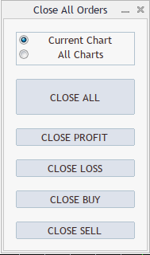
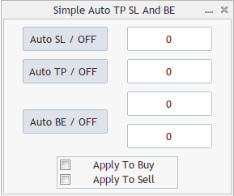
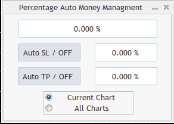
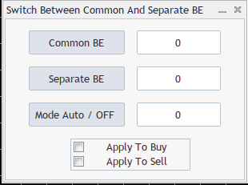
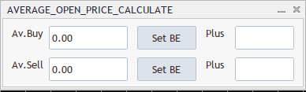
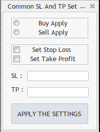
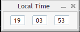
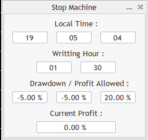

# MQL4 Utility Expert Advisors for MetaTrader 4

A collection of open-source utility Expert Advisors for MetaTrader 4, originally published on my [MQL4.com profile](https://www.mql5.com/en/users/michal_herda).  
These tools are **strictly auxiliary** — they do **not** open, manage, or close trading positions. Their purpose is to support analysis, workflow, and platform-level tasks within MT4.

The project is shared as open-source for educational and reference purposes.  
All utilities are self-contained, reusable, and intended to demonstrate practical MQL4 patterns rather than trading logic.

> Note: The code is provided as-is. The project is no longer actively maintained.

## Close All Orders Assistant (MT4 Utility EA)

A standalone utility Expert Advisor for MetaTrader 4 providing a simple graphical interface to **manually close existing orders** based on selected criteria.

This EA was created as a **practical, reliability-first tool**, following a legacy-style MQL4 approach. The primary goal was to deliver a working, self-contained solution that traders could use immediately, rather than focusing on architectural abstractions or extensibility.

**Key characteristics:**
- GUI-based control panel built using native MQL4 `Dialog` and `Controls`
- Button-driven, event-based logic
- Works on **existing orders only** (no order opening, no trading logic)
- Can be applied to the **current chart or all charts**
- Designed as a single-file, standalone utility EA

**Available actions:**
- Close all orders
- Close profitable orders only
- Close losing orders only
- Close BUY orders
- Close SELL orders

**Important notes:**
- This EA does **not** open, modify, or manage trades automatically
- Profit and loss checks are based on open price only (swap and commission are not included)
- The code follows a legacy, procedural MQL4 style and is no longer actively maintained

## Simple Auto TP / SL and BE (Legacy Utility EA)

This Expert Advisor was intentionally written in a **legacy-style, straightforward MQL4 approach**.  
The goal was not abstraction or over-engineering, but **predictable behavior, explicit logic, and direct control** over trade modifications — exactly how many older, production-used MT4 utilities were built.

### Purpose

`Simple Auto TP SL And BE` automatically manages **Stop Loss**, **Take Profit**, and **Break Even** levels for open positions.  
All levels are calculated as **point distances from the order open price**, making the logic transparent and easy to reason about.

### Key Features

- **Auto Stop Loss**
  - Sets SL at a fixed point distance from the open price
- **Auto Take Profit**
  - Sets TP at a fixed point distance from the open price
- **Auto Break Even**
  - Moves SL to a Break Even level after price reaches a defined trigger
- **Separate control for BUY and SELL orders**
- **Manual GUI control**
  - Everything is controlled from an on-chart panel
- **Tooltip-based guidance**
  - Each UI element explains its function directly on hover

### How It Works (Design Notes)

- No event queues, no external state machines  
- Direct use of:
  - `OrderSelect`
  - `OrderModify`
  - Per-tick validation and normalization
- Logic is executed:
  - on **UI interaction**
  - on **chart events**
  - on **every tick**
- This makes behavior **easy to trace in logs** and simple to debug in real trading environments

### Why “Legacy Style” on Purpose?

This EA reflects how many **real-world MT4 tools were (and still are) written**:

- Flat structure
- Explicit state flags
- Minimal dependencies
- GUI tightly coupled with trading logic

## Percentage Auto Money Management (Legacy Utility EA)

This Expert Advisor is a **percentage-based risk control utility**, designed to automatically close positions when a predefined **account profit or loss percentage** is reached.

It was intentionally implemented in a **classic, legacy MQL4 style**, focusing on explicit calculations, direct order handling, and transparent execution logic rather than abstraction or framework-based design.

### Purpose

The EA monitors floating profit/loss and compares it against **user-defined percentage thresholds**:

- **Percentage Stop Loss (max loss)**
- **Percentage Take Profit (target profit)**

When a threshold is reached and the corresponding option is enabled, the EA **sends close orders for active positions**.

This tool is meant as a **safety and capital protection layer**, independent of any trading strategy.

### Key Features

- **Percentage-based Auto Stop Loss**
  - Closes positions when loss exceeds a defined percentage of account balance
- **Percentage-based Auto Take Profit**
  - Closes positions when profit target (in %) is reached
- **Current chart or all charts scope**
  - Works per symbol or across all symbols
- **Optional cost handling**
  - Can include or exclude:
    - SWAP
    - Commission
- **Live calculation display**
  - Real-time percentage P/L shown directly in the UI
- **Manual GUI control**
  - Enable/disable Auto SL and Auto TP via on-chart buttons

### How It Works (Design Notes)

- Profit is calculated using:
  - `OrderProfit()`
  - `OrderSwap()`
  - `OrderCommission()`
- Percentage is derived from:
  - current profit vs. `AccountBalance()`
- Logic is evaluated:
  - on **every tick**
  - on **UI input changes**
- When conditions are met:
  - the EA sends **explicit close orders**
  - it does not attempt to manage positions silently

### Legacy Design Rationale

This EA reflects a **production-style MT4 utility approach**:

- Flat structure and explicit state variables
- Manual separation of:
  - profit
  - swap
  - commission
- Direct order loops using `OrderSelect` and `OrderClose`
- Heavy logging for traceability during live execution

The goal was **clarity, predictability, and operational safety**, not minimal code size or modern abstraction.

## Switch Between Separate and Common Break Even (Legacy Utility EA)

This Expert Advisor provides a **manual and semi-automatic way to manage Break Even (BE) stop losses** for multiple open positions on the same symbol.

It was intentionally implemented in a **classic, legacy-style MQL4 architecture**, prioritizing explicit calculations, deterministic behavior, and direct order modification over abstraction or modern design patterns.

### Purpose

The EA allows switching between two Break Even management modes:

- **Common Break Even**
  - A single shared SL level calculated from the **average open price** of all positions
- **Separate Break Even**
  - Individual SL levels calculated **per position**, based on each order’s open price

An optional **Auto Mode** dynamically switches between these two modes based on market conditions and position profitability.

### Key Features

- **GUI-based control panel**
  - On-chart buttons, input fields, and checkboxes
- **Common Break Even**
  - SL calculated from the average open price of all BUY or SELL positions
- **Separate Break Even**
  - Individual SL per position, applied only when all positions are profitable
- **Auto Mode**
  - Automatically switches:
    - to *Common BE* when not all positions are profitable
    - to *Separate BE* after a defined price movement threshold is reached
- **BUY / SELL scope selection**
  - Apply logic to BUY positions, SELL positions, or both
- **Point-based configuration**
  - All BE levels and triggers are defined in points for full transparency

### How It Works (Design Notes)

- Uses direct order iteration with:
  - `OrderSelect`
  - `OrderModify`
- Average prices are calculated manually using:
  - lot-size-weighted sums
- Profitability checks are explicit:
  - price vs. open price
  - no hidden heuristics
- GUI events and trading logic are tightly coupled, following a typical MT4 utility pattern
- Logic is executed through:
  - button clicks
  - chart events
  - explicit mode switches

### Legacy Design Rationale

This EA reflects how **real-world MT4 position management tools were commonly built**:

- Single-file, self-contained implementation
- Procedural logic with explicit state flags
- Heavy use of on-chart GUI controls
- Designed for **manual control and predictability**, not full automation

The focus was on **operational clarity and stability**, ensuring that every stop-loss modification is traceable and understandable during live execution.

> This utility is part of a larger collection of independent MT4 tools, each solving a specific position-management problem without introducing trading or signal logic.

## Calculate Average Price (Legacy Utility EA)

This Expert Advisor provides a **manual and semi-automatic way to calculate and manage the average open prices** of BUY and SELL positions for the current symbol.

It was intentionally implemented in a **classic, legacy-style MQL4 architecture**, prioritizing explicit calculations, deterministic behavior, and direct order modification over abstraction or modern design patterns.

### Purpose

The EA allows traders to:

- View the **average BUY and SELL prices** of all open positions on the chart symbol.
- Detect the **minimal lot size** among open positions.
- **Set Break Even (BE) stop losses** automatically at the calculated average price for BUY or SELL positions.

### Key Features

- **GUI-based control panel**
  - On-chart labels, edit fields, and buttons
- **Average Price Calculation**
  - BUY and SELL prices are calculated as **lot-size-weighted averages**
- **Minimal Lot Detection**
  - Identifies the smallest lot among BUY and SELL positions
- **Break Even Management**
  - `Set BE` buttons adjust SL to the calculated average price
- **Real-time Updates**
  - Average prices and minimal lot sizes update automatically on every tick

### How It Works (Design Notes)

- Uses direct order iteration with:
  - `OrderSelect`
  - `OrderModify`
- Average prices are computed manually:
  - summing `OrderOpenPrice * OrderLots`
  - dividing by total lot size
- Minimal lot size is tracked per trade type
- GUI events are handled explicitly:
  - button clicks
  - edit field changes
- No hidden heuristics or abstraction layers — all calculations are explicit

### Legacy Design Rationale

This EA reflects how **real-world MT4 position utilities were commonly built**:

- Single-file, self-contained implementation
- Procedural logic with explicit state management
- Heavy use of on-chart GUI controls
- Designed for **manual oversight and predictability**, ensuring every stop-loss modification is traceable during live trading

## Common SL and TP Set (Legacy Utility EA)

This Expert Advisor provides a **manual way to set a common Stop Loss (SL) and/or Take Profit (TP) for all open positions** on the current chart symbol.

It was implemented in a **classic, legacy-style MQL4 architecture**, prioritizing explicit order modification, deterministic behavior, and GUI-based interaction over abstraction or modern design patterns.

### Purpose

The EA allows traders to:

- Enter a single **Stop Loss** and/or **Take Profit value**.
- Apply the values **uniformly to all BUY or SELL positions** on the current symbol.
- Ensure consistency of SL/TP levels across multiple positions with minimal effort.

### Key Features

- **GUI-based control panel**
  - Radio buttons to select **BUY Apply** or **SELL Apply**
  - Checkboxes to select **Set Stop Loss** and/or **Set Take Profit**
  - Input fields for SL and TP values
  - **Apply** button to execute the modification
- **Validation**
  - Ensures SL/TP values are logically consistent with current price (e.g., BUY SL < Bid)
  - Prints detailed logs for each modification attempt
- **Current chart only**
  - Modifications are applied exclusively to positions on the chart symbol

### How It Works (Design Notes)

- Uses direct order iteration with:
  - `OrderSelect`
  - `OrderModify`
- GUI events are explicitly handled:
  - Radio group → choose BUY/SELL scope
  - Check group → select SL and/or TP
  - Edit fields → input SL/TP values
  - Button click → triggers modification for selected positions
- Provides clear textual feedback in the Experts log
- No automatic trading logic — strictly a **position-management utility**

### Legacy Design Rationale

This EA reflects how **real-world MT4 utilities were historically built**:

- Single-file, self-contained implementation
- Procedural logic with explicit state flags
- Heavy reliance on on-chart GUI controls
- Designed for **manual control and predictability**, ensuring each SL/TP change is traceable during live trading

## Local / Server / GMT Clock (Legacy Utility EA)

This Expert Advisor provides a **simple on-chart clock** displaying current time in **Local, Server, or GMT** mode.

It was implemented in a **classic, legacy-style MQL4 architecture**, emphasizing straightforward GUI updates and minimal logic.

### Purpose

The EA allows traders to:

- View the **current hour, minute, and second** directly on the chart.
- Switch between **Local Time, Server Time, or GMT Time**.
- Keep an accurate reference for market timing or manual trading decisions.

### Key Features

- **GUI-based display**
  - Three edit fields for hours, minutes, and seconds
  - Always read-only, updated in real-time
- **Time mode selection**
  - `Local_Time` (default, most accurate)
  - `Server_Time`
  - `GMT_Time`
- **Real-time updates**
  - Uses a millisecond timer to refresh every second
- **Lightweight and transparent**
  - No trading logic, purely informational
  - Fully procedural, single-file structure

### How It Works (Design Notes)

- Updates the edit fields via `ObjectSetString` each timer tick
- Automatically pads single-digit values with leading zero
- Chart redraw triggered to maintain real-time accuracy
- GUI is simple and self-contained, following typical MT4 utility design

### Legacy Design Rationale

This EA reflects **classic MT4 utility patterns**:

- Single-file, procedural design
- Explicit on-chart GUI updates
- Minimal abstraction, fully predictable behavior
- Focused purely on **manual time reference**, not trading automation

## Stop Machine – VPS Safety & Overtrading Guard

**StopMachine.mq4** is a tool designed to **protect traders from excessive risk and overtrading**. It is perfect for running on a VPS, operating in the background and monitoring the account balance in real-time, automatically closing all positions when daily limits are reached.

### Purpose

The EA acts as an **account safety mechanism**, ensuring that:

- You do not exceed the **maximum allowed daily drawdown**.
- You do not surpass a **daily profit limit** that could encourage risky decisions.
- It monitors the account independently in real-time on a **VPS**, regardless of the trader’s manual actions.

### Key Features

- **Automatic closure of all positions** (`CloseAll`) when limits are reached.
- **Daily reference point (initial balance)** set at a configurable hour and minute.
- **Support for multiple safety conditions:**
  - `Drawdown_Allowed` – maximum daily drawdown (%)
  - `TopDrawdown_Allowed` – additional limit if previous daily profit exists
  - `Profit_Allowed` – maximum daily profit (%)
- **Real-time monitoring and display**:
  - Current local time
  - Account status
  - Daily profit/loss percentage
- **Configurable GUI options** – values can be changed without editing the code:
  - Hour and minute of initial balance recording
  - Drawdown and profit limits

### How It Works

1. **Daily reference point:** EA records the account balance at the specified hour and minute.
2. **Daily profit calculation:** Compares current balance to the reference point.
3. **Limit checking:** If daily profit or drawdown exceeds the set values, the EA automatically closes all positions.
4. **Risk prevention:** Works on a single symbol or all symbols (optional).

### Architecture

- Classic MQL4 GUI using **CAppDialog** and **CEdit/CLabel**.
- 250 ms timer for display updates and limit monitoring.
- Functions `Close_Buy_Instruction` and `Close_Sell_Instruction` for precise position closing.
- Simple and transparent system for risk monitoring in a VPS environment.

### Why It Works

StopMachine operates independently from the trader, providing **peace of mind and capital protection**. Perfect for:

- VPS running 24/7
- Limiting daily losses
- Preventing impulsive overtrading

> This EA is **not designed to generate profits** – its purpose is to protect the account and enforce trading discipline.

